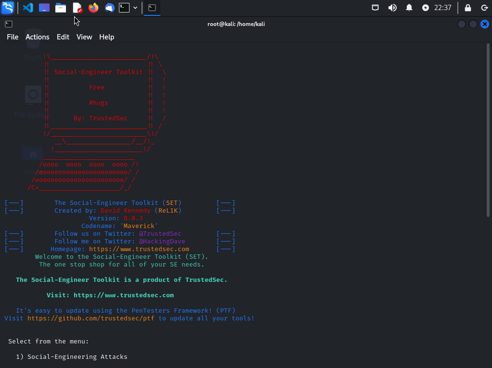

# Authorized Social Engineering Simulation with SET

## Overview

This lab explored a controlled social-engineering simulation using the Social-Engineer Toolkit (SET) in an isolated cyber range. I reviewed SET's menu-driven workflow and configured the components of a simulated phishing exercise, including a benign training payload workflow, a controlled listener, local web hosting, and a test email delivery path.

The purpose was to understand how social-engineering campaigns combine persuasion, impersonation, staged content, and command-and-control infrastructure so defenders can recognize and disrupt them. No real person, public system, production mail service, or external organization was targeted.

This portfolio entry intentionally excludes credentials, email addresses, organization names, IP addresses, ports, payload names, phishing wording, commands, and proprietary step-by-step course instructions.

## Lab Evidence

*SET running in the authorized Kali Linux lab before the simulated exercise was configured.*

## Lab Environment

- Kali Linux virtual machine
- Social-Engineer Toolkit
- Metasploit Framework integration
- Local web service
- Isolated mail-delivery environment
- Simulated endpoint and recipient
- Private cyber-range network

## Objectives

- Explore the major SET social-engineering modules.
- Understand the stages of a controlled phishing simulation.
- Configure a lab-only payload and listener workflow.
- Stage a training file on a local web service.
- Create a simulated email lure in a closed environment.
- Identify indicators generated at the email, network, endpoint, and identity layers.
- Recommend controls that interrupt the attack chain.
- Document ethical, legal, and operational safeguards.

## Authorization and Safety Boundaries

Social-engineering testing directly affects people and can lead to credential exposure, malware execution, business disruption, or reputational harm. This activity was performed only in a purpose-built virtual lab with fictional identities and systems.

A real assessment would require written authorization defining:

- Approved recipients and organizational sponsor
- Test purpose and success criteria
- Permitted pretext and delivery channels
- Prohibited themes and protected populations
- Infrastructure and network boundaries
- Payload behavior and data-collection limits
- Help-desk and incident-response coordination
- Emergency stop procedure
- Evidence retention and privacy requirements
- Debriefing and training plan

The techniques documented here must not be used against real recipients or systems without explicit authorization.

## Social-Engineer Toolkit

SET is an open-source framework for authorized social-engineering assessments. Its menu-driven interface organizes workflows such as simulated phishing, website-based exercises, removable-media scenarios, and payload/listener integration.

The lab used SET to understand attacker workflow and defensive telemetry, not to distribute a functional artifact outside the cyber range.

## Simulation Architecture

The exercise used separate components for delivery and controlled callback handling:

1. A Kali Linux assessment VM hosted the SET workflow.
2. A lab-only artifact was generated for the simulated endpoint.
3. A listener waited for an authorized connection inside the range.
4. A local web service staged the training download.
5. A second SET session prepared the simulated message.
6. The closed lab mail path delivered the lure to a fictional recipient.
7. Defensive evidence was evaluated across the attack chain.

Keeping listener and delivery operations logically separate made the sequence easier to observe and document.

## Payload and Listener Concepts

The lab demonstrated how a reverse-connection payload attempts to initiate an outbound session from an endpoint to a waiting handler. Attackers favor this model because many environments restrict unsolicited inbound traffic more heavily than outbound traffic.

For safety, a professional simulation should use the least harmful mechanism that meets the learning objective. Prefer harmless click tracking, dedicated simulation agents, or inert files when code execution is unnecessary.

Required controls include:

- Lab-only callback addresses
- Non-routable or isolated infrastructure
- Short-lived listeners
- No persistence
- No credential theft
- No collection of personal files
- No movement beyond the designated endpoint
- Immediate cleanup after validation

## Hosted Delivery

The exercise used a local web service to represent a download location. Hosting a file rather than attaching it illustrates how adversaries attempt to bypass attachment controls and move delivery to the web layer.

Defenders should monitor:

- Newly observed domains or hosts
- Direct-IP hyperlinks
- Archive downloads
- Executables extracted from archives
- Unsigned or low-reputation files
- Browser-to-script or browser-to-process execution chains
- Downloads followed by unusual outbound connections

An archive does not make a file safe. Security controls should inspect content after extraction and at execution time.

## Simulated Phishing Message

The training message used common persuasion patterns without publishing the original lure. The scenario demonstrated:

- Impersonation of an internal support function
- A look-alike sender identity
- Urgency and threatened loss of access
- A link to an externally staged file
- A request to download, extract, and execute content
- Priority markers intended to attract attention

These are recognizable warning signs, especially when several appear together.

## Look-Alike Domains and Sender Spoofing

Attackers often register domains that differ from a trusted name by one character, a missing letter, a substituted symbol, or an alternate top-level domain. Display names can further disguise the true sender.

Defensive controls include:

- SPF, DKIM, and DMARC enforcement
- Display of external-sender banners
- Detection of newly registered and look-alike domains
- Protection of high-value brand domains
- Mailbox impersonation analytics
- User-interface emphasis on the actual sender address
- Reporting mechanisms for suspicious messages

Email authentication reduces some spoofing risks but does not prevent an attacker from using a legitimately registered look-alike domain.

## Attack-Chain Analysis

| Phase | Simulated activity | Defensive opportunity |
| --- | --- | --- |
| Preparation | Configure lab infrastructure | Threat intelligence and asset monitoring |
| Delivery | Send a controlled lure | Secure email gateway and DMARC policy |
| User interaction | Open message and follow link | Awareness training and browser controls |
| Download | Retrieve an archived file | Web filtering and content inspection |
| Execution | Launch the staged artifact | Application control and endpoint protection |
| Callback | Initiate an outbound session | Egress filtering, proxy, IDS, and EDR |
| Follow-up | Validate the simulation | Incident response and evidence review |

Defense in depth is essential because no individual layer is guaranteed to block every attempt.

## Email Security Controls

Recommended controls include:

- Enforce SPF, DKIM, and DMARC with monitored reporting.
- Block or quarantine dangerous attachment types.
- Inspect URLs at delivery and click time.
- Detonate suspicious content in a sandbox.
- Flag newly registered or visually similar domains.
- Disable automatic execution of active content.
- Provide a simple phishing-report button.
- Correlate reports from multiple recipients.
- Protect privileged users with stronger policies.

Controls should be tested regularly with safe simulations and tuned to reduce both missed attacks and disruptive false positives.

## Endpoint Security Controls

Endpoint defenses can interrupt the exercise after delivery:

- Application allowlisting
- Attack-surface-reduction rules
- Endpoint detection and response
- Antivirus and reputation services
- Restricted scripting and macro execution
- Removal of unnecessary local administrator rights
- Browser download protections
- Archive and child-process monitoring
- Host firewall and outbound controls
- Rapid isolation capability

An endpoint warning should not be treated as the sole safety barrier; users can be persuaded to bypass warnings.

## Network Security Controls

Network-layer mitigations include:

- Egress filtering based on business need
- Web proxy and DNS filtering
- TLS inspection where authorized and lawful
- IDS or IPS signatures
- Network segmentation
- Blocking direct outbound connections to unapproved destinations
- Detection of beacon-like traffic
- Monitoring newly observed services and certificates
- Restricting outbound traffic from user workstations

Allowing unrestricted outbound traffic can make reverse connections easier to establish.

## Detection Opportunities

Useful indicators may appear in several data sources:

### Email Telemetry

- Sender-domain similarity
- Authentication failures
- Unusual reply-to address
- High-priority flag
- Archive or executable references
- Message delivery to unusual recipients

### Web and DNS Telemetry

- Direct-IP URL access
- Newly observed hostnames
- Archive downloads
- Low-reputation destinations
- First-seen domains

### Endpoint Telemetry

- Browser creating an archive utility or executable child process
- Execution from download or temporary directories
- Unsigned or rare binaries
- Security-warning bypass
- New outbound connection immediately after execution

### Network Telemetry

- Outbound connection to an unusual service
- Long-lived encrypted sessions
- Connections to nonstandard infrastructure
- Repeated callback attempts

Correlation across these layers provides more confidence than any individual indicator.

## Incident Response Workflow

If a similar event occurred outside an approved simulation:

1. Preserve the original message and headers.
2. Identify all recipients and delivery status.
3. Block malicious senders, domains, URLs, and hashes as appropriate.
4. Isolate endpoints that downloaded or executed content.
5. Collect process, network, persistence, and authentication evidence.
6. Reset exposed credentials and revoke active sessions when warranted.
7. Search the environment for related indicators.
8. Remove artifacts and restore affected systems.
9. Validate containment and monitor for recurrence.
10. Document lessons learned and improve controls.

Evidence should be preserved before cleanup when the incident-response plan requires forensic analysis.

## Ethical Simulation Design

An effective exercise measures resilience without harming participants. Good design avoids collecting real passwords, humiliating individuals, using traumatic pretexts, or creating unnecessary fear.

Metrics should emphasize system improvement:

- Delivery and filtering rate
- Report rate and reporting speed
- Time to triage
- Time to containment
- Control coverage
- Repeat exposure by business process
- Quality of help-desk and incident-response actions

Results should be used for coaching and control improvement rather than public blame.

## Cleanup and Validation

At the end of the lab, a safe cleanup process should confirm:

- The listener is stopped.
- Temporary web and mail services are stopped if no longer needed.
- Staged artifacts and archives are removed.
- Simulated messages are deleted according to lab policy.
- No persistence was created.
- No unexpected session remains active.
- Logs required for documentation are retained securely.
- The virtual environment is reverted or destroyed as appropriate.

## Security Concepts Demonstrated

- Authorized social-engineering assessment
- Phishing pretext analysis
- Look-alike domain detection
- Payload and listener architecture
- Reverse-connection risk
- Web-based delivery
- Email authentication
- Endpoint and network defense in depth
- Detection engineering
- Incident response
- Ethical testing and cleanup

## Results

- Launched and explored SET in Kali Linux.
- Reviewed the available social-engineering assessment modules.
- Configured a lab-only payload and listener workflow.
- Staged a controlled training artifact on a local web service.
- Prepared a simulated phishing message using a fictional identity.
- Evaluated indicators across email, web, endpoint, and network layers.
- Identified preventive and detective controls for each attack phase.
- Developed incident-response, ethical-testing, and cleanup recommendations.

## Key Takeaways

- Social engineering combines technical delivery with psychological manipulation.
- Look-alike domains and display names can make malicious messages appear legitimate.
- Archive-based delivery does not make executable content trustworthy.
- Outbound filtering can disrupt reverse-connection behavior.
- Email authentication is necessary but cannot stop every impersonation technique.
- Endpoint, email, web, DNS, and network telemetry should be correlated.
- Safe simulations require written authorization, privacy protections, and cleanup.
- The best exercises improve organizational controls rather than punish individuals.

## Skills Demonstrated

- Social-Engineer Toolkit navigation
- Authorized phishing simulation design
- Payload and listener architecture analysis
- Controlled web-hosting concepts
- Email impersonation and look-alike-domain analysis
- Email, endpoint, and network control mapping
- Detection and incident-response planning
- Ethical testing and evidence handling
- Security awareness measurement
- Professional cybersecurity documentation
